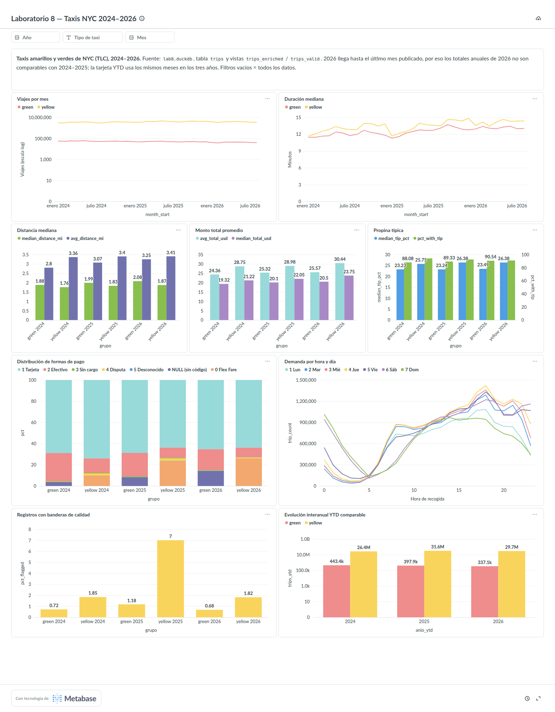

# Tablero en Metabase

**Nombre:** Laboratorio 8 — Taxis NYC 2024–2026

**Base utilizada:** `/workspace/data/processed/lab8.duckdb` dentro del contenedor `metabase`
(el mismo archivo `data/processed/lab8.duckdb` del proyecto, montado en solo lectura). Conexión
DuckDB llamada `lab8 DuckDB` con la opción *Establish a read-only connection* activada. Las
tarjetas consultan la tabla `trips` y las vistas `trips_enriched` / `trips_valid`.



## Tarjetas

| Tarjeta | Indicador | Bloque de `sql/indicators.sql` | Visualización |
|---|---|---|---|
| Viajes por mes | A — volumen mensual | `ind_a_volumen_mensual` | línea por tipo (eje log) |
| Duración mediana | C — duración típica | `ind_c_duracion` (nivel mensual) | línea por tipo |
| Distancia mediana | B — distancia típica | `ind_b_distancia` | barras mediana y promedio por tipo/año |
| Monto total promedio | D — monto total | `ind_d_monto_total` | barras promedio y mediana por tipo/año |
| Propina típica | F — propinas | `ind_f_propinas` | barras propina mediana (%) y % con propina |
| Distribución de formas de pago | E — métodos de pago | `ind_e_pagos` | barras apiladas (%) por tipo/año |
| Demanda por hora y día | G — patrón hora × día | `ind_g_demanda_hora_dia` | línea por hora, una serie por día |
| Registros con banderas de calidad | H — calidad | `ind_h_calidad` | barras % con bandera por tipo/año |
| Evolución interanual YTD comparable | volumen YTD | `evo_volumen_ytd` | barras por año y tipo (eje log) |

Arriba hay un texto que recuerda que 2026 es parcial y que la tarjeta YTD compara los mismos
meses en los tres años (el último mes común se calcula en SQL).

## Filtros globales

- **Año** (`anio`, número): `source_year`.
- **Tipo de taxi** (`taxi`, texto: `yellow` / `green`): `taxi_type`.
- **Mes** (`mes`, número): `source_month`.

Están conectados a todas las tarjetas mediante variables opcionales `[[AND ... = {{...}}]]`
que reemplazan el marcador `/*filtros*/` de `sql/indicators.sql`. Si un filtro queda vacío,
la tarjeta usa todos los datos.

## Cómo recrearlo

1. Ejecuta el notebook completo (o `scripts/materialize.py`) para generar `lab8.duckdb` y asegúrate de
   que no quede ninguna conexión de escritura abierta.
2. Levanta Metabase: `docker compose up -d metabase` y espera a que http://localhost:3000 responda.
3. Ejecuta (el script crea el usuario administrador si Metabase es nuevo, la conexión de solo lectura,
   sincroniza el esquema, crea las 9 tarjetas, el tablero y los filtros, y ejecuta cada tarjeta para
   comprobar que no falle):

   ```bash
   docker compose exec -e MB_EMAIL=<correo> -e MB_PASSWORD=<contraseña> analysis \
       python scripts/metabase_dashboard.py --url http://metabase:3000
   ```

4. Abre *Colección raíz → Laboratorio 8 — Taxis NYC 2024–2026*.

Si cambias la tabla (por ejemplo, al agregar un año), detén Metabase, vuelve a materializar,
levántalo de nuevo y repite el paso 3 o usa *Admin → Databases → lab8 DuckDB → Sync database schema*.

## Captura

`dashboard_overview.png` se tomó con Chrome headless sobre un enlace público temporal del tablero,
que se revocó después de la captura:

```bash
docker compose exec -e MB_EMAIL=... -e MB_PASSWORD=... analysis \
    python scripts/metabase_dashboard.py --url http://metabase:3000 --public-link
google-chrome --headless=new --hide-scrollbars --window-size=1600,2000 --virtual-time-budget=90000 \
    --screenshot=docs/dashboard/dashboard_overview.png http://localhost:3000/public/dashboard/<uuid>
docker compose exec -e MB_EMAIL=... -e MB_PASSWORD=... analysis \
    python scripts/metabase_dashboard.py --url http://metabase:3000 --revoke-public-link
```

Para tomarla a mano: abre el tablero sin filtros, en una ventana de unos 1600 px de ancho, y captura
la página completa desde el título hasta las tarjetas de calidad y de evolución YTD.
